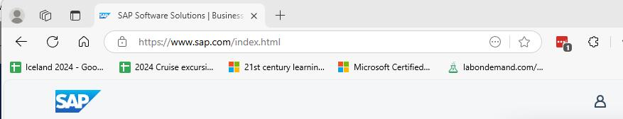
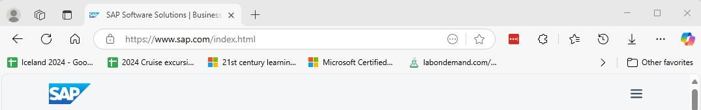
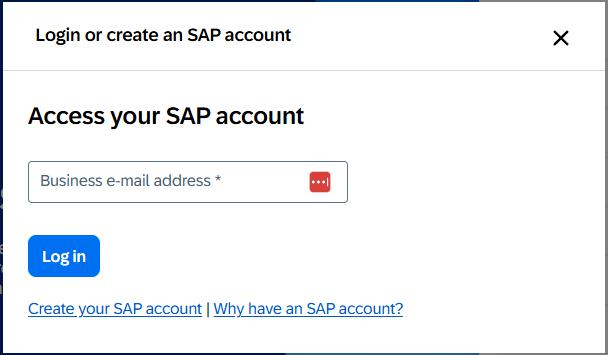
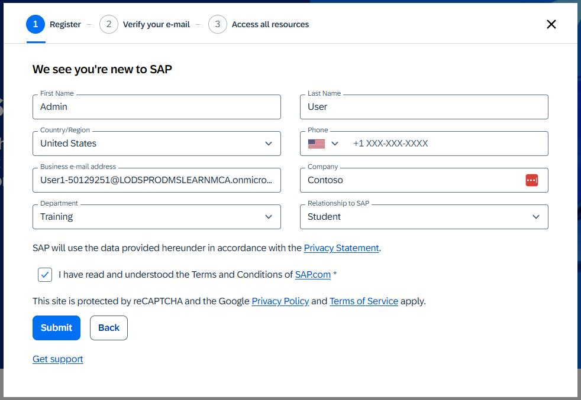
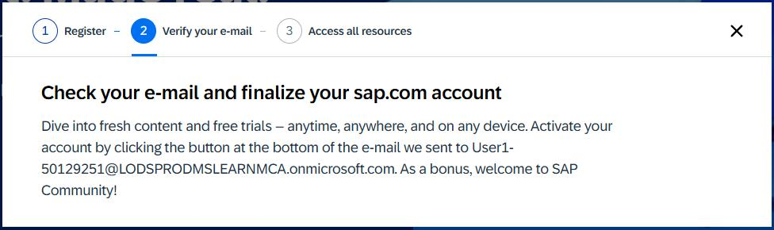
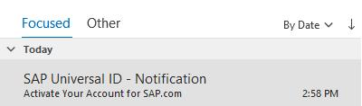
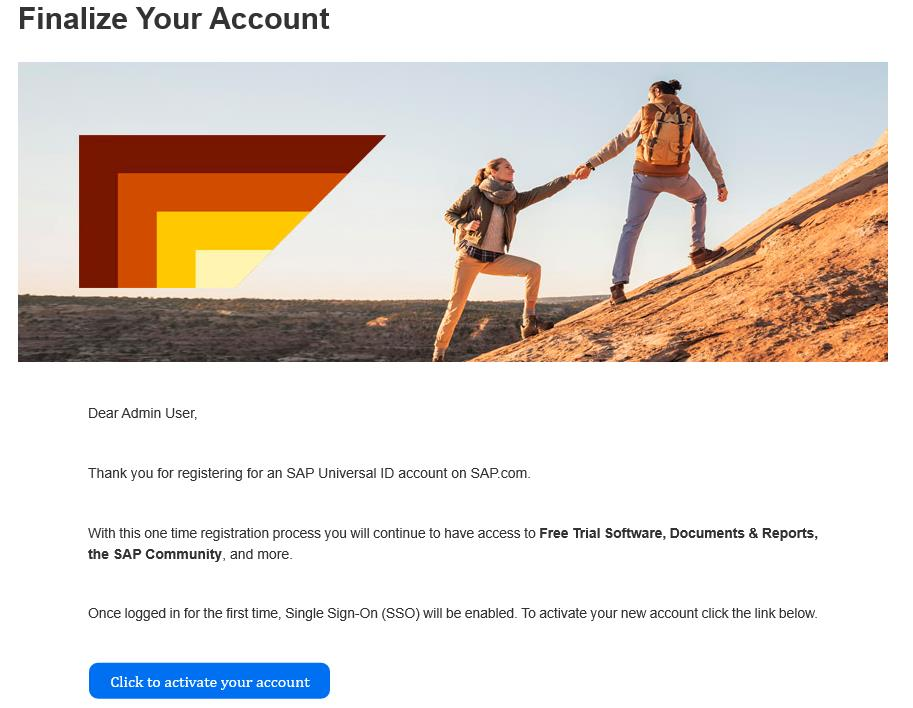
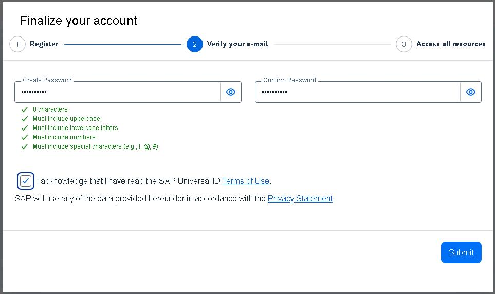
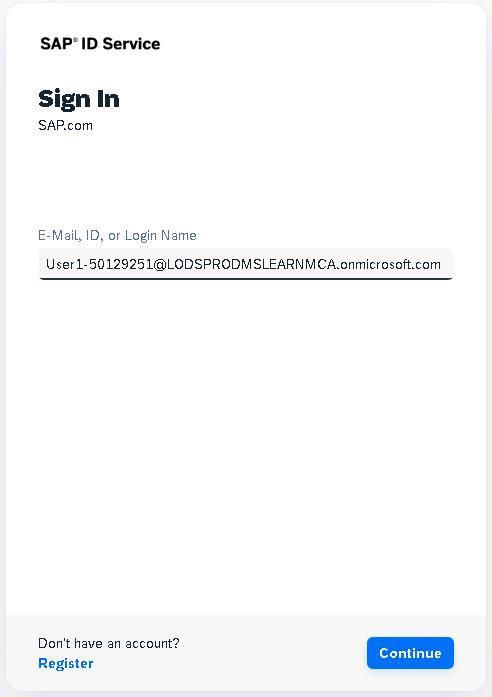
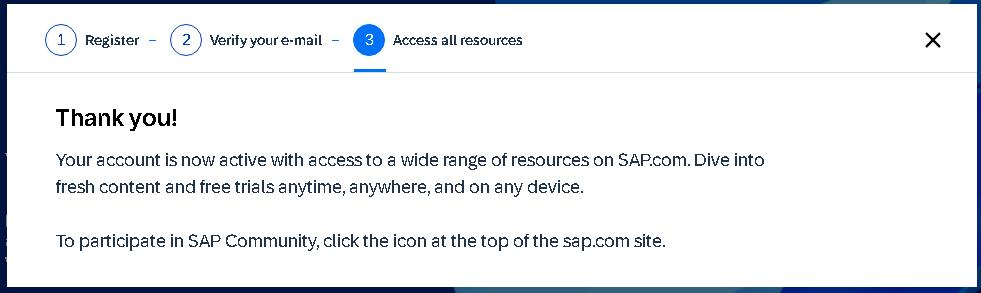

# Task 01: Create an SAP account

## Introduction

AP controls access to demos and documentation. You need to create an account before you can access the SAP Gateway Demo system data.

## Description

In this task, you create an account so that you can access SAP resources.

## Success criteria

- You receive an email from SAP that includes the URI and credentials to access the SAP Gateway Demo system.
- You successfully connect to the AP Gateway Demo system. 

## Learning resources

-   [SAP Home page](https://www.sap.com/index.html "SAP Home page")

## Key tasks

### 01: Create the SAP account

 
  
<strong>Expand this section to view the solution</strong>
 

1. Open Edge and go to [SAP page](https://www.sap.com).

1. At the upper right of the page, select the Sign in icon. 

    

    {: .note }
	> If the **Sign in** icon is not visible, select the **&#9776;** icon.
    > 
	> 

1. In the **Login or create an SAP account** dialog, select **Create your SAP account**.

    

1. Enter the following information on the **Register** page of the **We see you're new to SAP** dialog:

    | Field | Value |
    |:---------|:------|
    | First name| `Admin` |
    | Last name |`User`   |
    | Country/Region   | Select your country/region   |
    | Business e-mail address   | Enter your work or personal email address   |
    | Company  | `Contoso`   |
    | Department   | **Training**   |
    | Relationship to SAP  | **Student**   |

1. Select the **I have read and understood the Terms and Conditions of SAP.com** checkbox and then select **Submit**.

    

1. If prompted, complete the Captcha process.

1. Wait for the **Verify your e-mail** page of the **We see you're new to SAP** dialog to display.

    

1. Open your email app and go to the inbox. Locate an email from the sender **SAP Universal ID - Notification**.

    

1. Open the email. Locate the hyperlink below the **Click to activate your account** button.

    

1. Copy the link and then paste it into a notepad document for later use.

    {: .warning }
	> After pasting the value into the text field, select the **Tab** key, or select any element outside of the text field. This ensures that the value is saved for use later in the lab.

1. Return to the lab environment. Open a new browser window and go to `@lab.Variable(SAPActivationLink)`.

1. In the **Finalize your account** dialog, enter `your SAP portal password`, confirm it to proceed.
 

1. Select the **I acknowledge that I have read the SAP Universal ID Terms of Use** checkbox and then select **Submit**.

    

1. On the **SAP ID Service** Sign in page, enter the following email address and then select **Continue**. Then enter a `SAP portal username`  

    

1. Wait for the **Thank you!** page to display.

     

1. Close the **Thank you** dialog.

