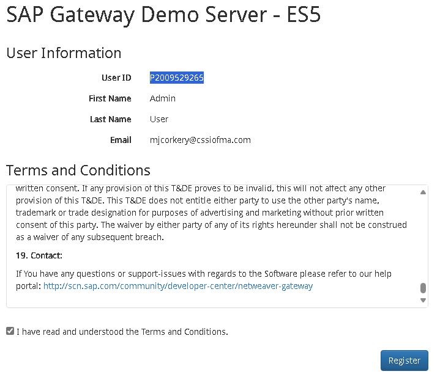
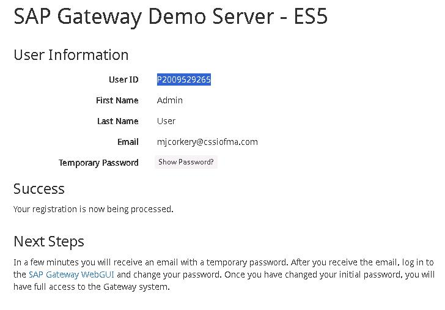
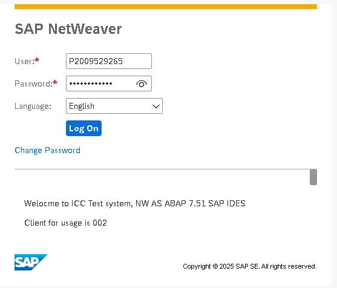
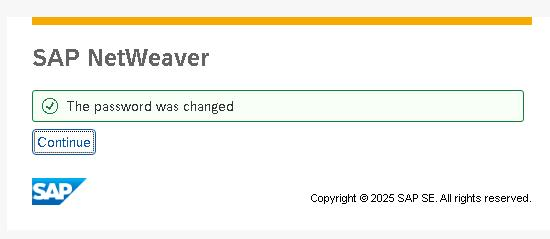
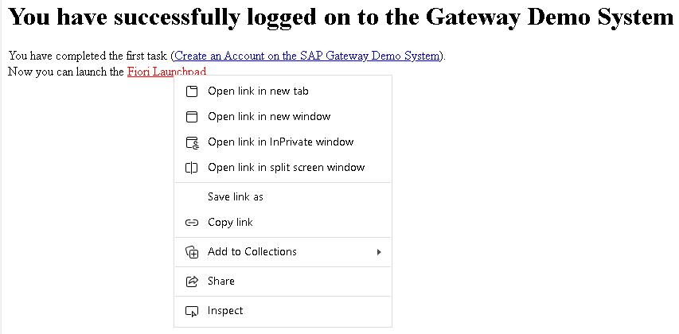
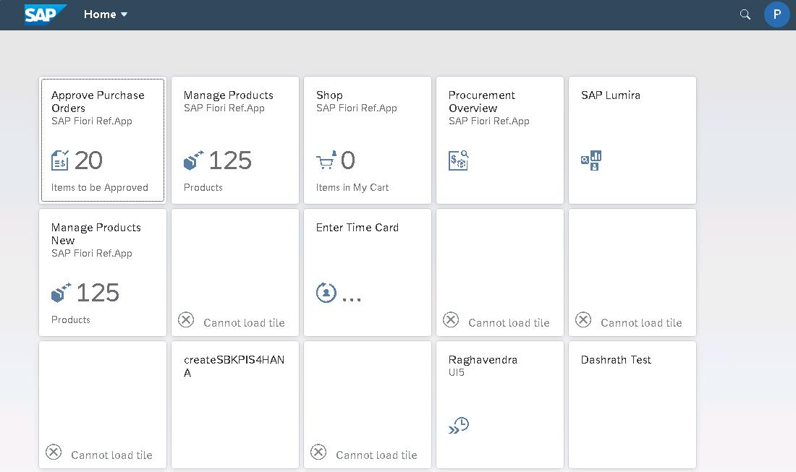

# Task 02: Create an account for the SAP Gateway Demo system

## Introduction
Now that you can access SAP resources, you must create an account to access demo data.

## Description

In this task, you sign in to the SAP developer site and create an account. The account provides access to the SAP Gateway Demo system. At the end of the process, you open the Fiori Launchpad app

## Success criteria

- You have valid credentials to use the SAP Gateway demo system
- You can open the Fiori Launchpad app. This app provides an environment where you can run SAP applications to explore data.

## Learning resources
-   [Create an account on the SAP Gateway Demo system](https://developers.sap.com/tutorials/gateway-demo-signup..html "SAP Gateway Demo system")
-   [SAP on Microsoft Labs](https://abicas.github.io/SapOnMicrosoftDemos/ "SAP on Microsoft Labs")
-   [Fiori Launchpad User Guide](https://help.sap.com/docs/btp/sap-fiori-launchpad-for-sap-btp/sap-fiori-launchpad-user-guide "Fiori Launchpad User Guide")

## Key tasks

### 01: Register on SAP Gateway Demo server

 
  
<strong>Expand this section to view the solution</strong>
 

1. Open a new browser window and go to [SAP Gateway Demo Server](https://register.sapdevcenter.com/SUPSignForms/). 

1. If prompted, sign in by using the following credentials: 

    Username: `your SAP portal username`  
    Password: `your SAP portal password`   

1. On the **SAP Gateway Demo Server -ES5** page that displays, copy the User ID value to the Windows clipboard and paste then in a notepad file for future use.

1. On the **SAP Gateway Demo Server -ES5** page, select the **I have read and understood the Terms and Conditions** checkbox and then select **Register**. 

    

1. You should see a new page display. The page will report that the registration is being processed.

1. Select **Show password**. Paste the temporary password into a notepad for future use.

    

    {: .note }
    > The SAP system will send you an email that includes the Server URI, username, and initial password.

1. Open a new browser window and go to the [SAP WebGUI](https://sapes5.sapdevcenter.com/sap/bc/gui/sap/its/webgui).

1. On the **SAP NetWeaver** page that opens, enter the following credentials and then select **Log on**:

    |       |          |
    |:------|:-------------------------------|
    | Username: | Your SAP Gateway Demo system user ID  | 
    | Password: | You SAP Gateway Demo system temporary password |
    
    

1. On the **SAP NetWeaver** page that displays, enter the following information to replace the temporary password and then select **Change**:

    |       |          |
    |:------|:-------------------------------|
    | Current Password: | `the SAP Gateway Demo system temporary password`  | 
    | New Password: | `your SAP portal password` |  
    | Repeat Password: | `your SAP portal password` |  

    

1. On the SAP NetWeaver page that displays, verify that the password was changed successfully and then select **Continue**.

    
    
1. The **You have successfully logged on to the Gateway Demo System** page displays. Right-click the **Fiori Launchpad** link and then select **Copy link**.

    

1. Copy the link then paste it into a notepad document for later use.

1. Select the Fiori Launchpad link to start the app.

    

