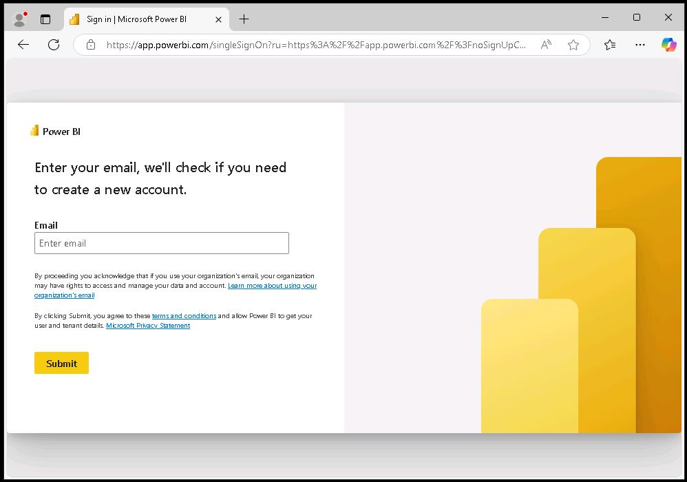
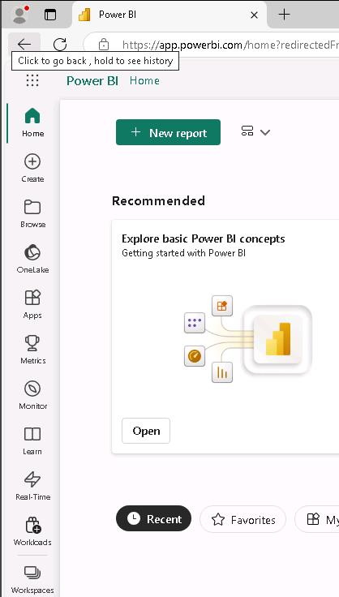
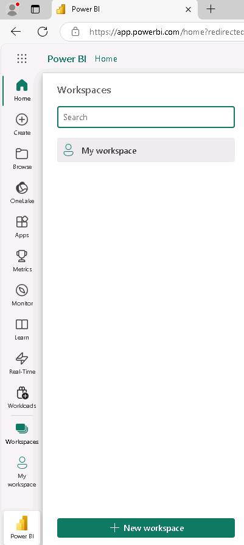
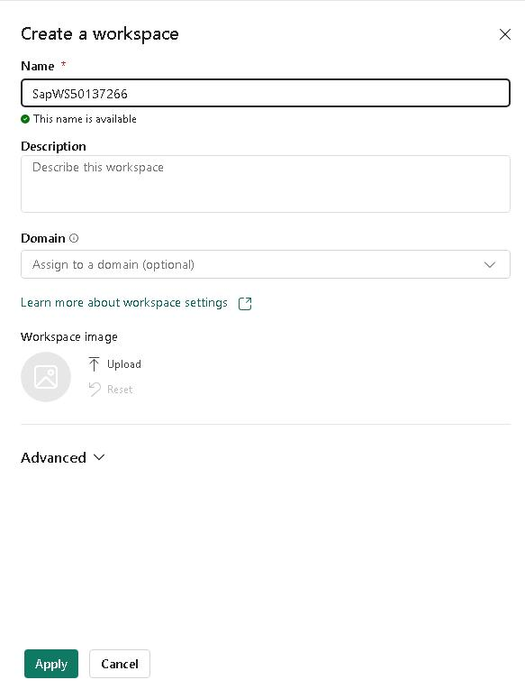
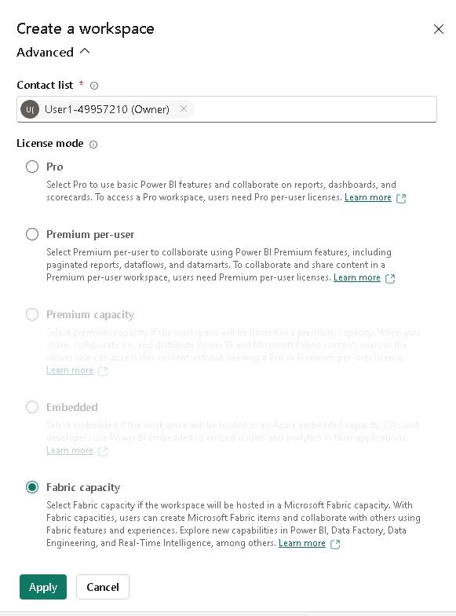
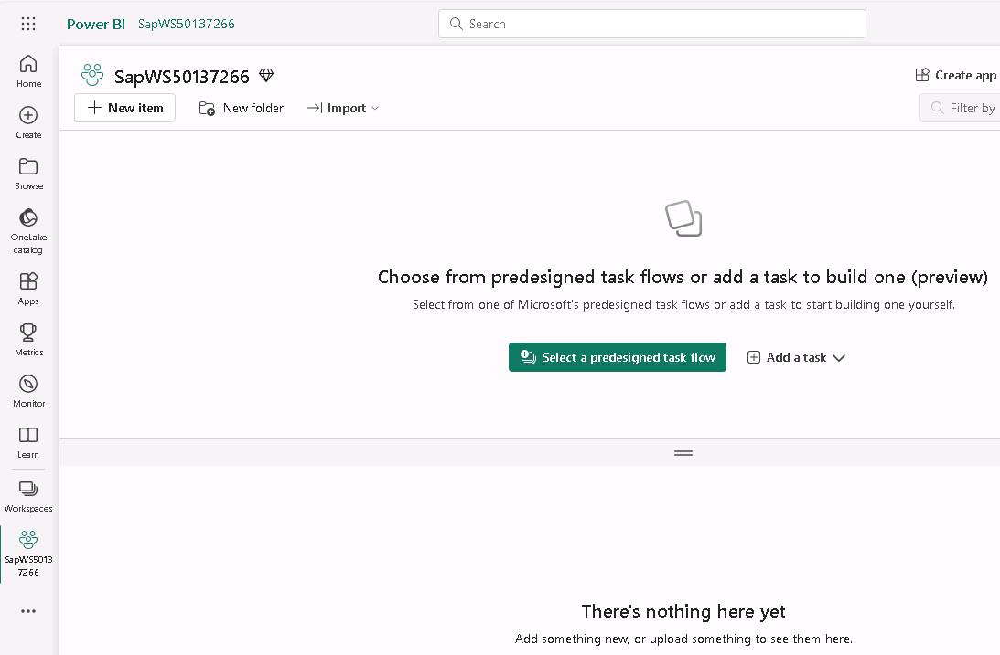

# Task 01: Sign in to the Microsoft Fabric website and create a workspace

## Introduction

In the previous exercise you created accounts so that you can access the SAP Gateway Demo system. Now you need to import some sample data into a Microsoft Fabric lakehouse. Later in the lab, you'll create a Copilot agent that uses the data in the lakehouse as a knowledge source to answer questions from users.

## Description

In this task, you configure access to Microsoft Fabric and create a workspace. The workspace organizes all resources that relate to a project. 

## Success criteria

-   You've signed in to the Microsoft Fabric website
-   You've created a workspace
-   The workspace uses Fabric capacity

## Learning resources

-   [Microsoft Fabric Overview](https://learn.microsoft.com/en-us/fabric/ "Microsoft Fabric Overview")
-   [Workspaces in Microsoft Fabric and Power BI](https://learn.microsoft.com/en-us/fabric/fundamentals/workspaces "Workspaces in Microsoft Fabric and Power BI")

## Key tasks

### 01: Launch Power BI Fabric

 
  
<strong>Expand this section to view the solution</strong>

1. Open a new browser window and go to [Power BI](https://app.powerbi.com).

    

1. If prompted, sign in by using the following credentials:

    |   |   |
	|:--|:--|
	|Username: | `your SAP portal username` | 
    |Password: | `your SAP portal password` |

1. On the Fabric home page, in the left pane, select **Workspaces**.

    

1. Select **New workspace**.

    

1. In the **Name** field, enter `SapWS@lab.LabInstance.Id`.

    

1. Select **Advanced** to expand the node. Verify that **Fabric capacity** is selected and then select **Apply**.  

    

    {: .warning } 
	> Please alert your coach if the **License mode** is set to anything other than **Fabric capacity**.

1. The **SapWS@lab.LabInstance.Id** workspace page displays.

    

1. Leave the **SapWS@lab.LabInstance.Id** workspace page open. You'll perform additonal steps in the workspace in Task 02.

