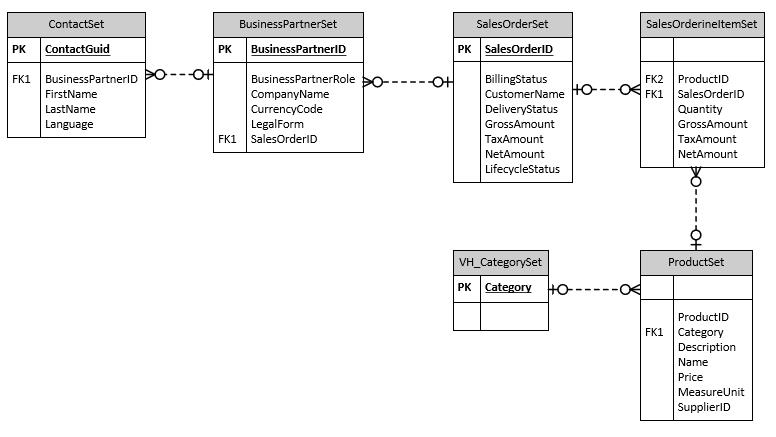

# Exercise 02: Create and configure resources

In this exercise, you'll create a pipeline in Microsoft Fabric to extract data from the SAP Gateway Demo system into a lakehouse. You'll create relationships between the lakehouse tables.

## Architecture

The OData connection that you'll use in this lab fetches data that relates to customers, sales orders, and products. The source includes over a dozen tables. 

For this lab, you'll be working with a subset of the tables. The diagram below shows the tables you'll use and the relationships between the tables. For simplicity, the diagram omits columns that are present in each table.

{: .warning } 
> This lab requires that Fabric capacity is assigned to the user account provisioned for this lab. When you get to Exercise 02, Task 01, Step 11, if you don't see that Fabric capacity is assigned, please alert your coach.

## Objectives
After you complete this exercise, you'll be able to:

-   Create a Microsoft Fabric workspace
-   Create a pipeline activity
-   Configure the pipeline to use the Copy Data assistant
-   Run the pipeline
-   Configure the lakehouse tables
-   Create an Azure OpenAI resource and deploy a model

## Duration
**Estimated time**: 15-20 minutes
