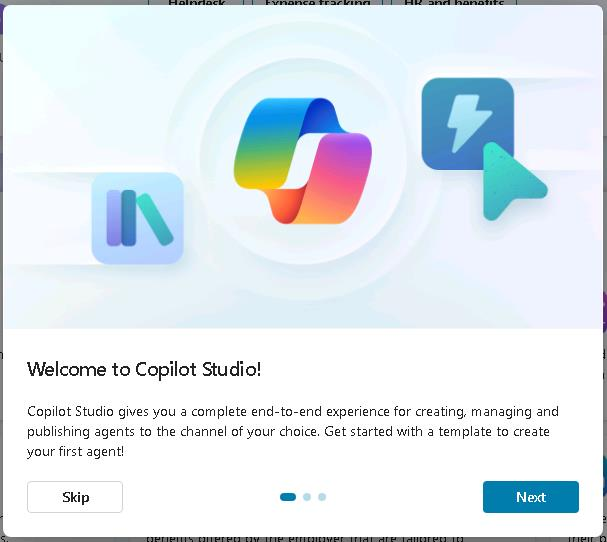
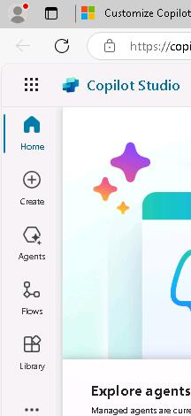
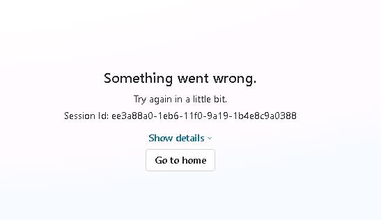
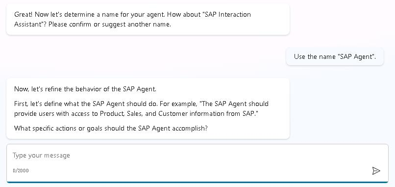
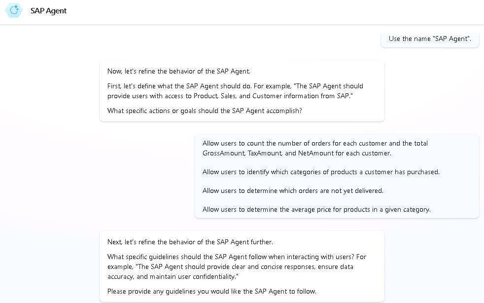
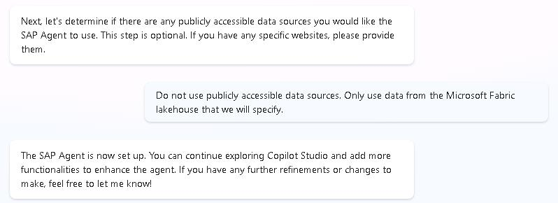
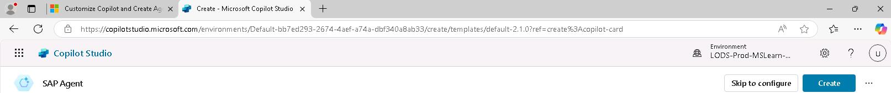

# Task 01: Create a Copilot agent
<!--Task 01 duration ~4 minutes-->

## Introduction

You've already ingested data from SAP into a Fabric lakehouse. Now, you need a way to query the data. A user will enter a business question about the data as a prompt to the Copilot agent. The agent will then use the prompt to query the data and return a response.

## Description

 In this task, you'll answer a set of prompts to create a Copilot agent.

## Success criteria

-   You've created a Copilot agent by answering a series of prompts.

## Learning resources

-   [Build Copilot agents](https://learn.microsoft.com/en-us/microsoft-365-copilot/extensibility/copilot-studio-agent-builder-build "Build Copilot agents")

## Key tasks

### 01: Access Copilot Studio and create the agent

<details markdown="block"> 
  <summary><strong>Expand this section to view the solution</strong></summary>

{: .warning } 
> For the steps in this task, you provide information to help create the Copilot agent. Please remember that Copilot agents are evolving very fast. The number of questions that you're asked and the order in which the questions are presented may differ from what you see in these steps.

1. Open a new browser tab and go to [Copilot Studio](www.copilotstudio.com).

1. Select your country/region and then select **Start free trial**.

    {: .note }
	> After you select **Start free trial**, there may be a delay before the next screen displays.

1. In the **Welcome to Copilot Studio** dialog, select **Skip**.

    

1. If prompted, sign in by using the following credentials:

    Username: `your SAP portal username`  
    Password: `your SAP portal password` 

1. In the left navigation pane for Copilot Studio, select **Create**.

    

1. On the **Create** page, select **+ New agent**.

    

    {: .warning }
	> An error message which resembles the following screenshot may display. The error message often indicates that the system is still initializing. If you see this error messages, return to the previous page, wait a couple of minutes, and select **+ New agent** again.

    


1. In the **Type your message** field, enter the following text and then select **Send**. Wait for Studio to load a response to your prompt.

    ```
	Create an agent that allows users to interact with Product, Sales, and Customer information that was ingested from SAP into a Microsoft Fabric lakehouse.
	```

    

1. In the *Type your message* field, enter the following text and then select **Send**. Wait for Studio to load a response to your prompt.

    ```
	Use the name "SAP Agent".
	```

    
    
1. In the **Type your message** field, enter the following text and then select **Send**. This prompt represents some common business questions that users may ask. Wait for Studio to load a response to your prompt.

    ```
	Allow users to count the number of orders for each customer and the total GrossAmount, TaxAmount, and NetAmount for each customer.
	Allow users to identify which categories of products a customer has purchased.
	Allow users to determine which orders are not yet delivered.
	Allow users to determine the average price for products in a given category.
	```

    

1. In the **Type your message** field, enter the following text and then select **Send**. Wait for Studio to load a response to your prompt.

    ```
	Don't use publicly accessible data sources. Only use data from the Microsoft Fabric lakehouse that we'll specify.
	```

    
    

1. At the upper right of the Copilot Studio page, select **Create**.

    

    {: .note }
	> It may take a few minutes to set up your agent.

</details>