##Task 03: Complete the topic and test the agent

## Introduction

You've successfully created a Copilot agent. Now, you need to test the agent. 

## Description

In this task, you'll test the agent from within Copilot Studio to ensure that the agent returns expected results.

## Success criteria

-   The agent returns the expected results

## Key tasks

### 01: Connect the flow to the agent and run tests

<details markdown="block"> 
  <summary><strong>Expand this section to view the solution</strong></summary>

1. Close the **Power Automate** page. You are returned to the Copilot Studio **Topic** page. If prompted, select **Done**.

    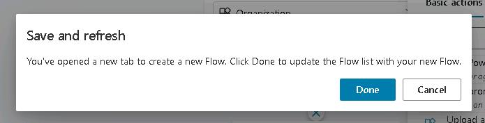

1. In the **Add an action** dialog, select **FlowForSapAgent**.

    {: .note } 
	> If you do not see **FlowForSapAgent**, save teh topic and then refresh the page.

    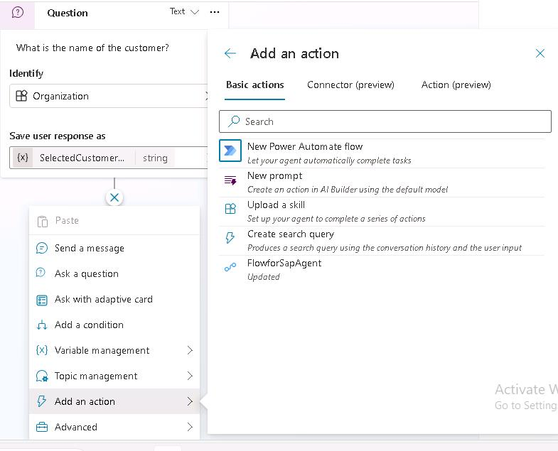

1. In the **Action** activity, in the **Enter or select a value** field, select **SelectedCustomerName**.

    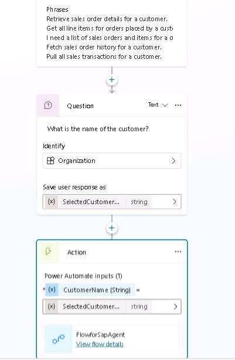

1. Select the **Add Node** button under the Action activity. Select **Send a Message**.

1. Select the **Insert variable** button (**{x}**). In the list of variables, select **response**.
    
    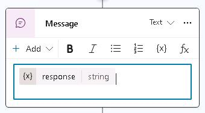

1. At the upper right of the SAP Agent page, select **Save** and then select **Test**.

    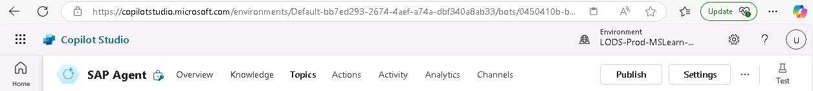

1. In the **Test your agent** pane, enter the following prompt and select the **Send** button.

    ```
	Get all sales transactions for a customer.
	```

    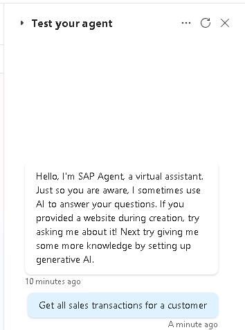

1. Enter **PicoBit** as the customer name. Be patient. For production agents, you will want to optimize the peformance of all elements of the agent.

    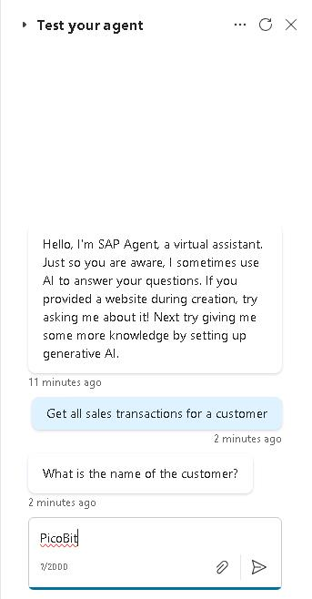

    {: .warning }
	> The first time you test the agent, you may see a message that resembles the message in the following screenshot.
    >
    >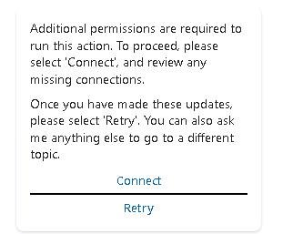
    >
    > If you see this message, select **Connect**. Then, on the **Manage your connections** page, select **Connect**.
    >
    >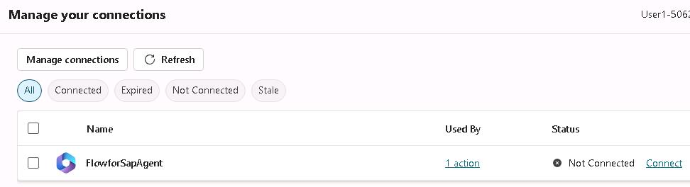
    > In the **Create or pick connections** dialog, select **Submit**.
    >
    >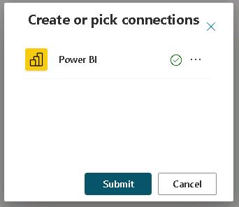
    > 
    > You should see that the status is *Connected*. Return to the Topics page and select **Retry**.
    >
    >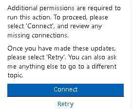

1. Review the response from the agent. The response may contain some extraneous information. You can adjust the inputs and outputs in the Power Automate flow to control and format the output.

</details>

---

### Congratulations. 
You have completed this lab!
    