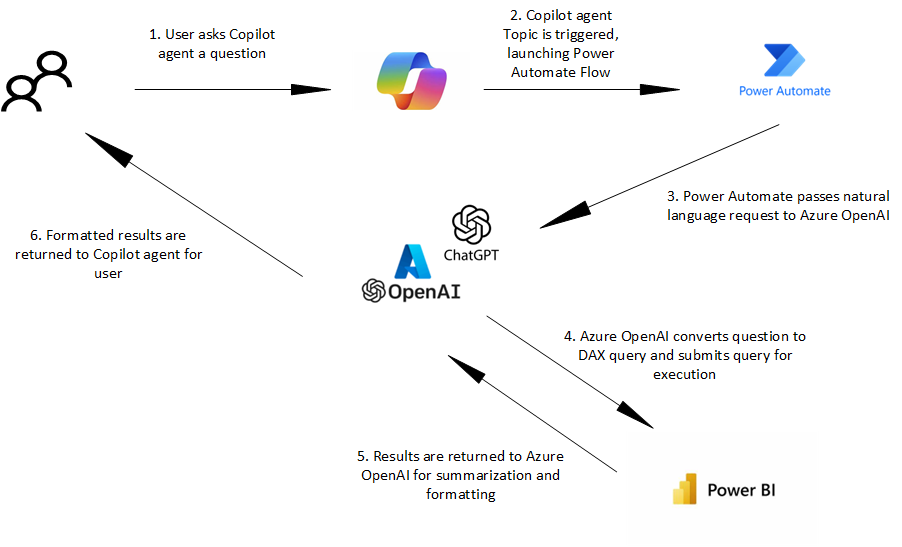

## Exercise 03: Create, configure, and test a Copilot agent
A Copilot agent will act as the interface between a user and the SAP data. In this exercise, you'll create and configure a Copilot agent. You'll then test the agent.

## Architecture

For this lab you will create a topic for the Copilot agent. When a user enters a prompt in the agent, the topic is triggered. The following diagram shows the process that occurs. The topic starts a Power Automate flow. The flow makes a call to the Azure OpenAI resource that you provisioned earlier to convert the users request into a Data Analysis Expressions (DAX) query. The DAX query is passed to a Power BI connector which connects to the lakehouse where the data is stored. 

After the query is executed the results are sent to Azure OpenAI for summarization and formatting. The final results are sent back to the Copilot agent as a response.

## Objectives
After you complete this exercise, you'll be able to:

-   Create a Copilot agent
-   Create a topic for the agent
-   Create a Power Automate flow for the topic
-   Test the agent

## Duration
**Estimated time**: 25-30 minutes